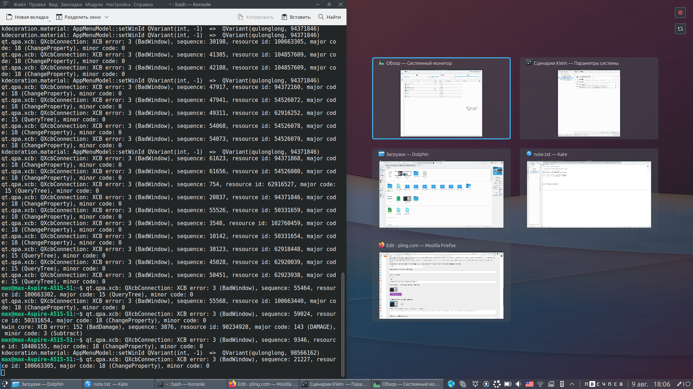

#  KDE Snap Assist
[KDE Store](https://store.kde.org/p/1875687)

This KWin script for KDE Plasma suggests other window thumbnails on snap. It tries to replicate the famous Windows 10/11 feature of the same name.

Assist can be shown by dragging a window to the screen edge, as well as via default keyboard shortcuts (`super`+arrows).
You can select the window with mouse, as well as with arrow keys + `Enter`. 
To dismiss the assist, hit `Escape` key, press the close button or click anywhere on the empty area. 
Script also supports quarter and triple tiling: you can switch layouts with the `Tab` key or using the button in corner.

Since version `1.4`, there are experimental *snap group* features:
- Minimize/restore snapped windows together ([demo](./assets/demos/snap%20groups/minimize-together.gif))
- Raise snapped windows together ([demo](./assets/demos/snap%20groups/raise-together.gif))
- On close snapped window, try to fill the area ([demo](./assets/demos/snap%20groups/fill-on-close.gif))
- Try to fit snapped window in groupo behind ([demo](./assets/demos/snap%20groups/fit-in-group-behind.gif))

When you enable any of these options in settings, the script will start tracking windows snapped with the script. Group of snapped windows is remembered once you fill the layout using the assist. Window is no longer considered snapped once it was closed or moved manually using the mouse. Snap groups are not persistent, and likely will be needed to recreate on each reboot.

Ideas, suggestions, bugs reports and contributions to the project are welcome!

---
### Manual Installation
In order to install this script manually from GitHub, you'd need to:
- Delete current version of script and re-login to KDE Plasma
- Download the code as .zip (green "Code" button > "Download as ZIP"), and rename file to .kwinscript extension
- Use the "Install from file" button in System settings > Windows manager > KWin scripts
- Re-login to Plasma again (or restart KWin) to make sure the script is installed

---
### Troubleshooting
- To apply the new settings, you may need to re-enable the script or restart KWin. The same is recommended if you switch from one version of the script to another
- Assist will not show if you have no other windows matching the conditions set in the script settings. For example, by default the script does not show windows from other screens — so, if you have only one window on the current screen, assist will not show
- Script settings button is not visible, or complains that "Plugin doesn't provide configuration file in the expected location" — this is a known KWin's bug, not related to the script. Make sure your system is up-to-date, as it seems to be fixed now. If it doesn't help, you can also try to install the script [manually](https://github.com/emvaized/kde-snap-assist#manual-installation)

---
### Compatibility notes

#### Compatibility with [Window Gap](https://github.com/nclarius/tile-gaps)

- Since version 1.2, there's an option "Snap detect tolerance" in the script settings, which basically defines how much window's size and position can differ to still be detected as "snapped" by the script. If you use some external scripts which constantly modify windows size and position, you may want to set it to `15px` or `25px`, so that Snap Assist could detect your snaps.

#### Compatibility with [Exquisite](https://www.pling.com/p/1852610)

- Most of default layouts are supported out the box. You may also like to enable "Hide after tiling a window" in Exquisite's settings for the smoothest workflow. Over time, support for custom layouts will expand, possibly with ability to edit them.

#### Compatibility with [Sticky Window Snapping](https://www.pling.com/p/1112552)

- Fully compatible. Highly recommended to be used in conjunction with Snap Assist!

#### Compatibility with diagonal keyboard shortcuts

- Version 1.4 introduces an option "Delay before showing the assist", which gives some time to execute 'diagonal' shortcuts (`super` + `↑` + `→`) before Assist gets shown. The default value is `100ms`.

--- 

### Donate
If you **really** like this script, you can always thank for it by buying me a coffee :)

